# Shiny Hunt Recommendations

## Shiny Hunt - Bench Sit

Program: [Shiny Hunt - Bench Sit](ShinyHunt-BenchSit.md)

Right click -> Open Image for larger size.

| **Pokemon**  | **Instructions/Settings** | **Screenshots** |
| --- | --- | --- |
| Zone 20 Alphas | Use the East side benches near the fly entrance of Wild Zone 20.  **Run Forward Direction:** 3000 ms  This method will hit all 6 [spawner overloads.](https://www.youtube.com/watch?v=OuX9lfo_bKA) | 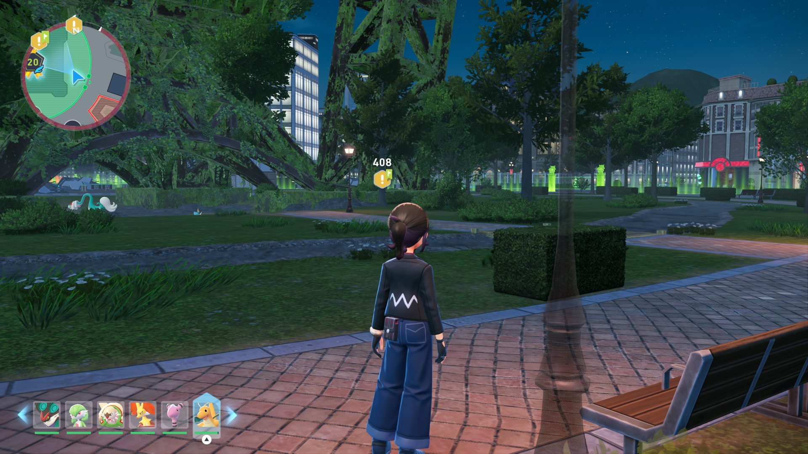 |
| Chikorita Bulbasaur | Bench in the North East corner of Wild Zone 20  **Run Forward Direction:** 0 | 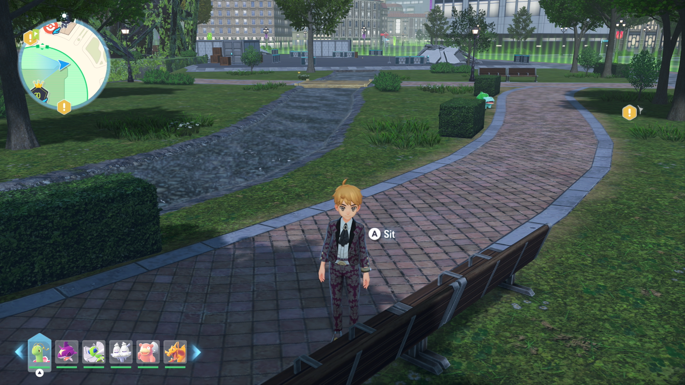 |
| Ralts | There are 2 Ralts spawners just north of Magenta Sector 7. On the roof of that building are benches.  **Run Forward Direction:** 0 | 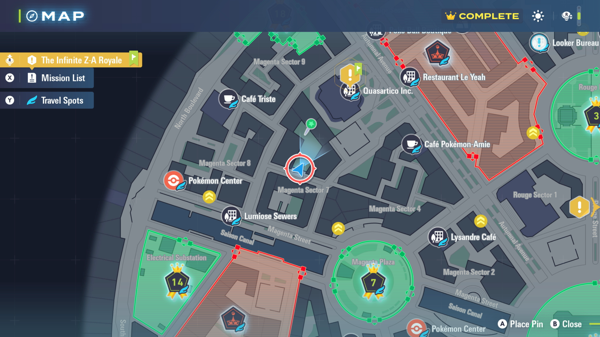 |
| Larvitar Pansear (Alpha) Pansage (Alpha) Panpour (Alpha)  | In Rouge Sector 7. Use the northmost bench.  **Run Forward Direction:** 0 | 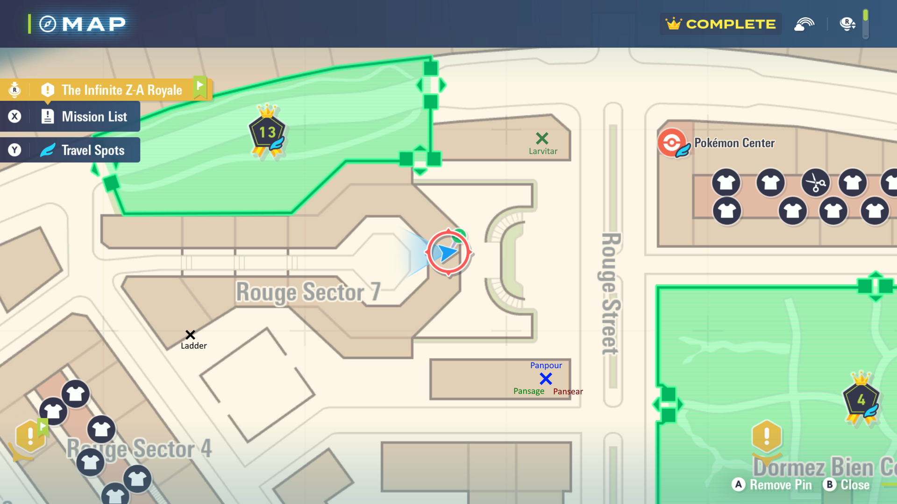 |
| Fennekin Lopunny (Alpha) Noibat Noivern Swablu Alteria Salamence (Alpha) Bagon Kakuna (Alpha) Weedle Trubbish Mawil/Gastly  | 1. Enter the Zone from the fly point. 2. Head down the left alleyway and out the exit near the scaffolding. 3. Climb the scaffolding.  **Run Forward Direction:** 0 | 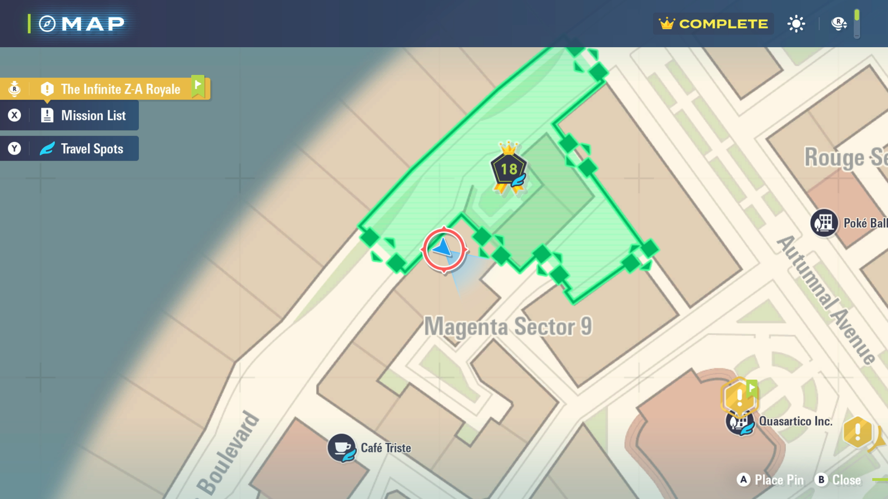 |
| Avalugg (Alpha) Abomasnow (Alpha) Snover Delibird Vanillite| West entrance of Wild Zone 12|  |
| Spritzee (Alpha) | Rooftop of Rouge Sector 7, next to Wild Zone 13|  |
| Manectric (Alpha) Meowstic (Alpha) Carbink Sableye Espurr Mawil (downstairs) Flechinder| Bench beside static Alpha Manectric on rooftop, in Wild Zone 9 **Run Forward Direction:** 2000 ms|  |
| Banette (Alpha) Beedrill (Alpha) Gourgeist (Alpha) Scolipede| Bench inside Wild Zone 15 | 
| Espurr | Bench South of Wild Zone 13. There are two spawns within range of the bench, located in the alley behind the building.  **Run Forward Direction:** 0 | 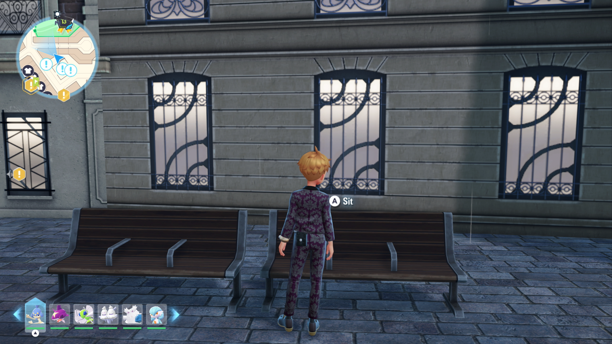 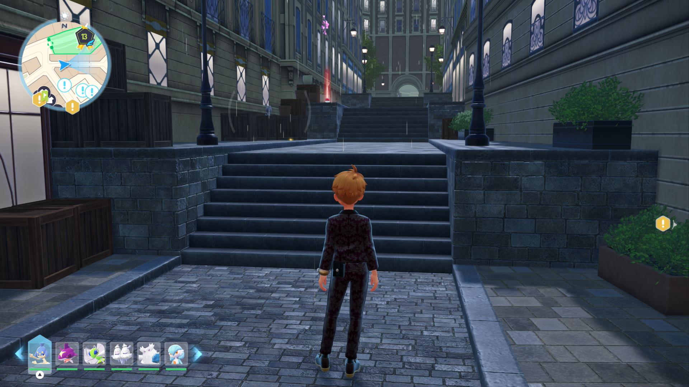 |
| Espurr  Meowstic (Alpha)  Carbink  Manectric (Alpha) | Bench on a building, West side of Wild Zone 9.  **Run Forward Direction:** 0 | 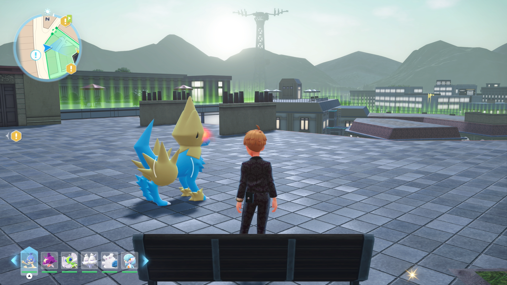 |
| Absol (Alpha)  Pansage | Bench on a building, West of Wild Zone 19.  **Run Forward Direction:** 0 | 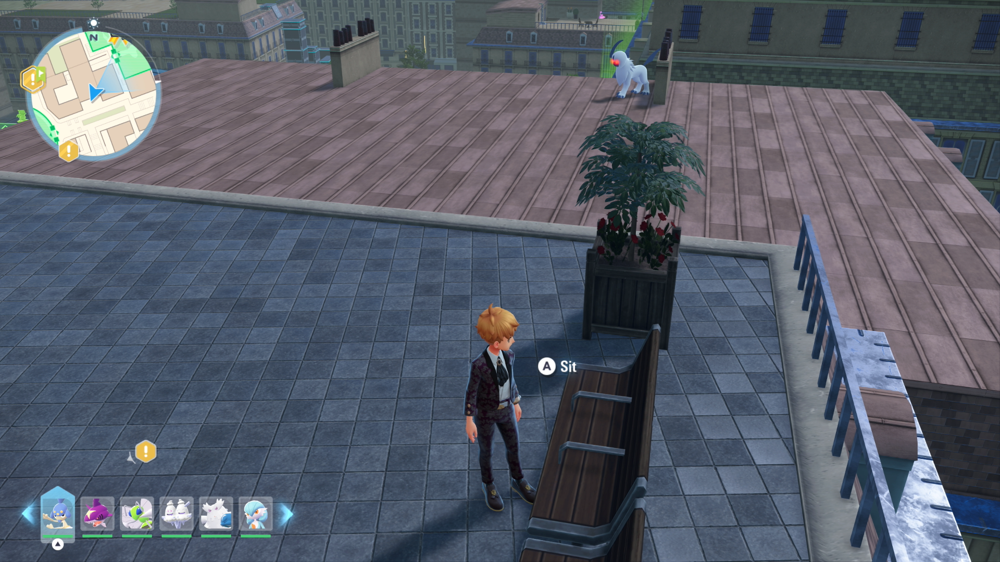 |
| Slowpoke  Carvanha  Sharpedo (Alpha)  Tynamo | Bench looking over the water, center of Wild Zone 10.  **Run Forward Direction:** 0 |  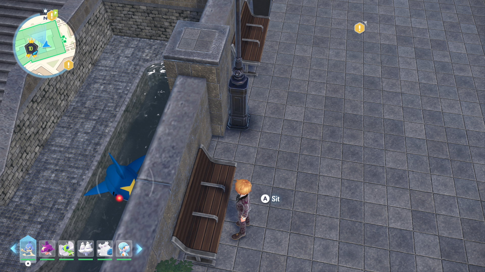|
| Pyroar (Alpha)  Skarmory| Bench East side of Wild Zone 17. Due to the aggressive Pyroar you will need to be quick to start the program.  **Run Forward Direction:** 0 |  |  |

## Shiny Hunt - Wild Zone Entrance

Program: [Shiny Hunt - Wild Zone Entrance](ShinyHunt-WildZoneEntrance.md)

| **Pokemon** | **Instructions/Settings** | **Screenshots** |
| --- | --- | --- |
| Fletchling Bunnelby| **Wild Zone 1**  **Walk Time in Zone:** 0 ms | 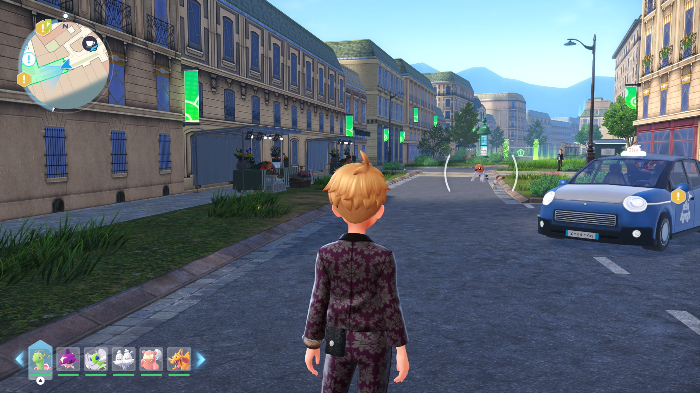 |
| Magikarp (Alpha) Staryu (Alpha) | **Wild Zone 2** **Walk Time in Zone:** 0 ms |  |
| Flabebe Skiddo Pikachu Litleo (Alpha) Pancham | **Wild Zone 3**  **Walk Time in Zone:** 2000 ms  | 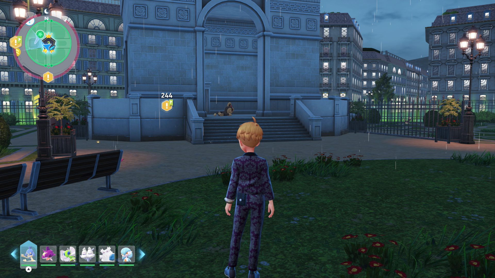 |
| Weedle Kakuna Spinarak Gastly| **Wild Zone 4**  **Movement:** Approach Gate But Don't Enter.  Weedle and Kakuna spawn in the tree to the North. Spinarak and Gastly will spawn just inside the gate.  | 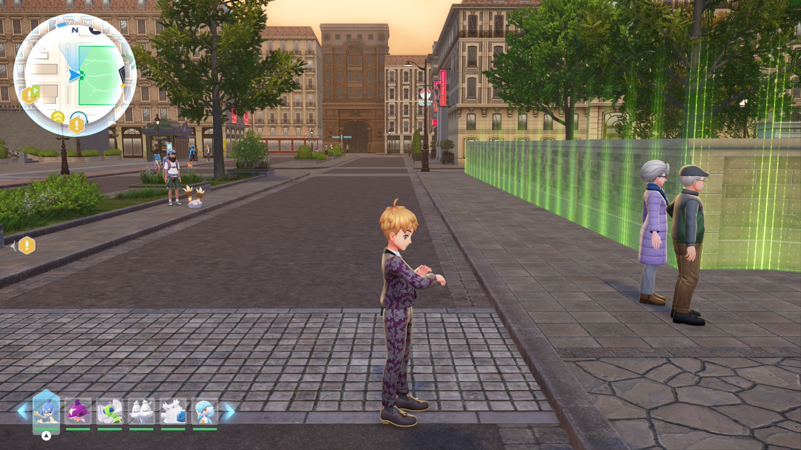 |
| Ampharos (Alpha) Froakie Florges (Blue)| **Wild Zone 5** **Walk Time in Zone:** 0 ms  Located in Zone 16 but flying to Wild Zone 5 covers it. |   |
| Whirlipede  (Alpha) Bellsprout (Alpha) Venepede Pidgey Bunnelby | **Wild Zone 5** **Walk Time in Zone:** 3000 ms  Whirlipede  will be in the sewers below. | 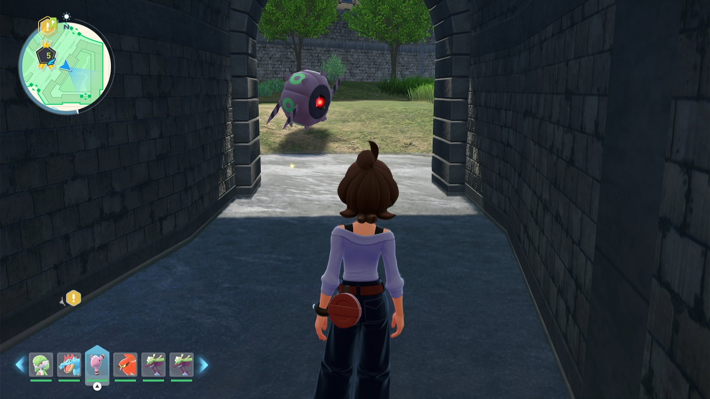 |
| Binacle (Alpha) Houndour Magikarp Buneary | **Wild Zone 6**  **Walk Time in Zone:** 0 ms  Multiple spawns below the bridge to the left of the gate. | 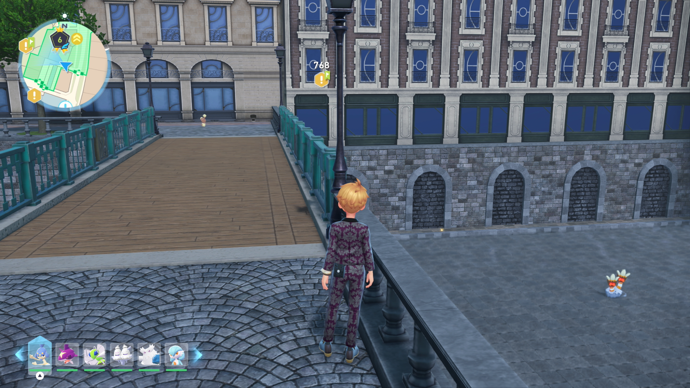 |
| Vanillite Hippopotas Fletchinder (Alpha) | **Wild Zone 7**  **Walk Time in Zone:** 500 ms | 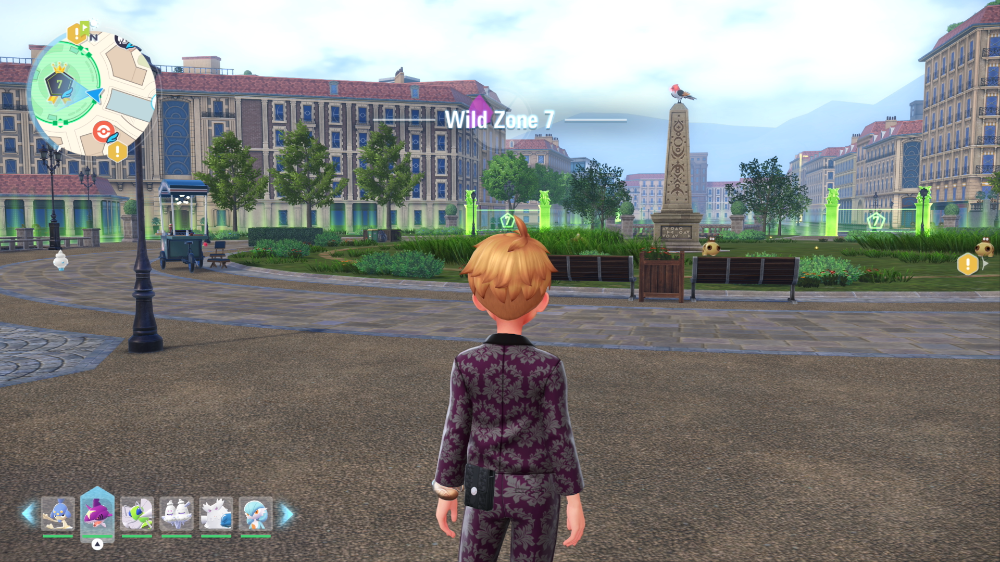 |
| Trubbish Garbodor (Alpha) | **Wild Zone 8**  **Movement:** No Movement.  Located in an Alley North East of the Fly Point | 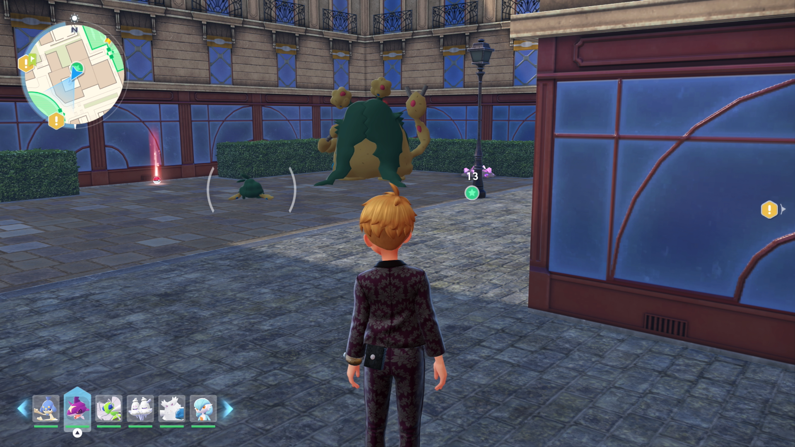 |
| Stunfisk Clauncher Clawitzer (Alpha) Gyarados | **Wild Zone 11**  **Movement:** No Movement. | 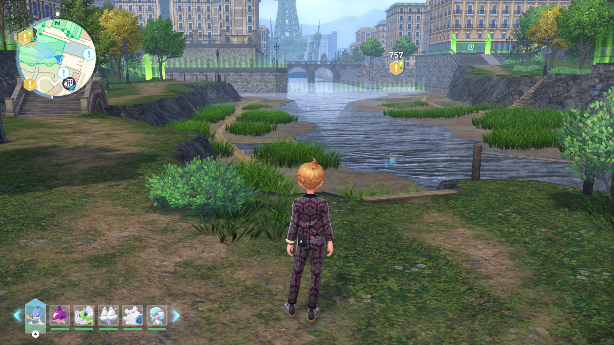 |
| Excadrill (Alpha) Drilbur Aron Lairon Emolga| **Wild Zone 14**  **Walk Time in Zone:** 2000 ms |   |
| Chespin Diggersby| **Wild Zone 17**  With overloaded spawners. **Movement:** No Movement|  |
| Salamence (Alpha)<Bagon> | **Wild Zone 18** Walk Time only needed for the Bagon. |  |
| Audino Kangaskhan Eevee Furfrou | **Wild Zone 19**  **Movement:** Approach Gate But Don't Enter. | 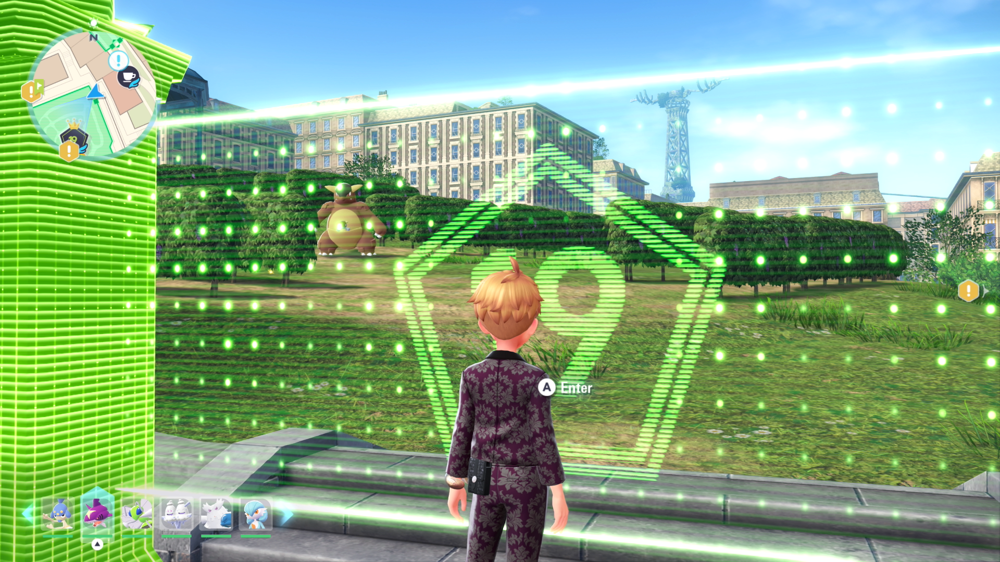 | 
| Totodile Squirtle| **Wild Zone 20**  **Walk Time in Zone:** 500 ms | 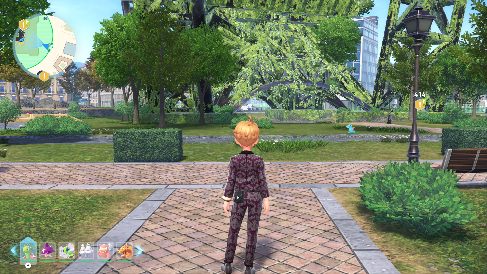 ||

<!-- 
Numel has a chance to be alpha and will agro the moment you enter the gate. Need to handle that before this is public
| Numel Camerupt (Alpha)  Drilbur  Sandile Krokorok  Machop  Gible | **Wild Zone 8**  **Walk Time in Zone:** 2000 ms  Remember to check the alley mentioned above for shiny Trubbish/Garbodor |  | 
-->

## Turbo A

Program: [Turbo A](../NintendoSwitch/TurboA.md) (located under the Nintendo Switch category)

| **Pokemon**  | **Instructions** | **Screenshots** |
| --- | --- | --- |
| Beldum, Metang | In Lysandre Labs, run to the Beldum room, then fly back to the lab entrance. Run to the teleporter in the screenshot and take it. Once you hear the Beldum cry, start Turbo A. [Video guide.](https://www.youtube.com/watch?v=DBwEtEonidI)| 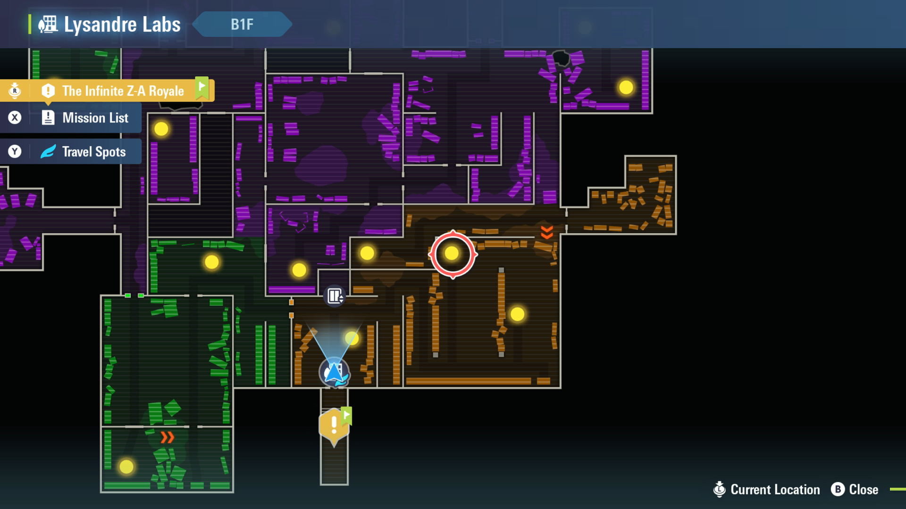 |
| Honedge, Doublade Arbok (Alpha) Ekans | Stand on the very first teleporter in Lysandre Labs. [Video guide](https://www.youtube.com/watch?v=l58_9xUD-Yk) | 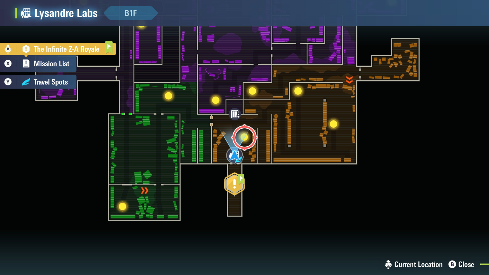 |
| Tepig Charmander | Fast Travel to Centrico Plaza, the first option in the Travel Spots. Run North West against the wall for ~10 seconds. | 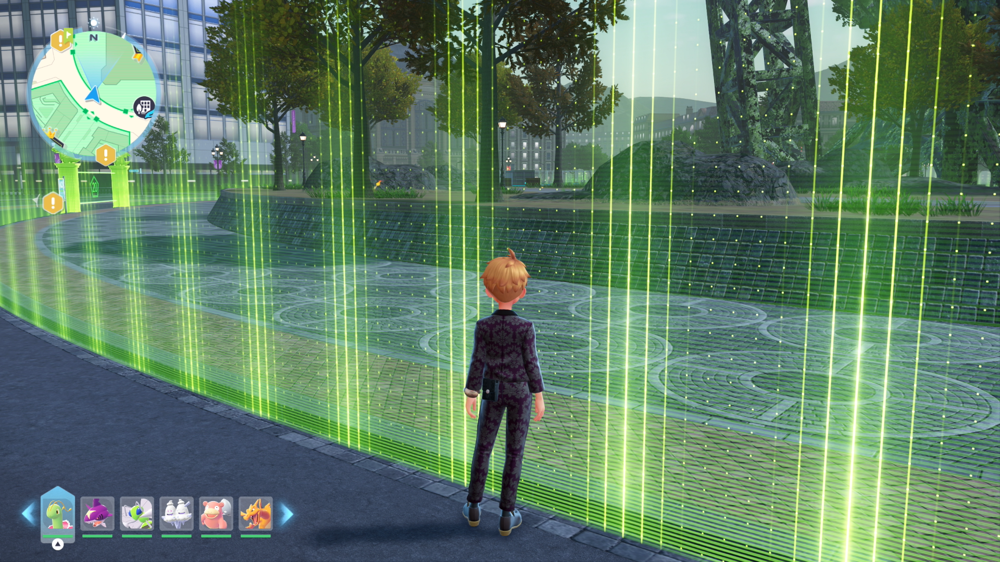 |
| Pichu Mareep | Fast Travel to Pokemon Research Lab, the third option in the Travel Spots. Turn around, run North East for ~5 seconds. | 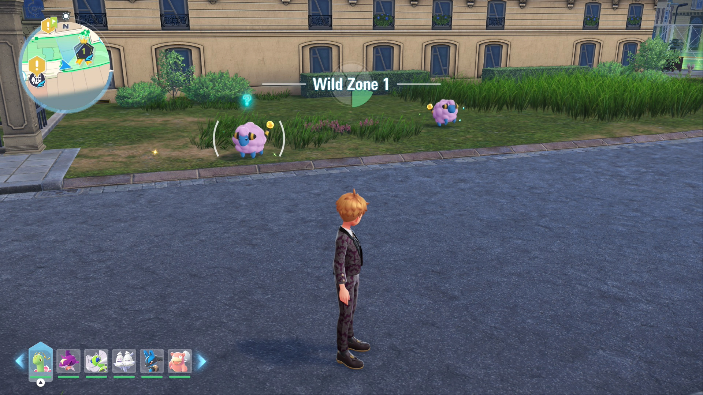 |

## Credits

- **Author:** Kuroneko/Mysticial, kichithewolf

